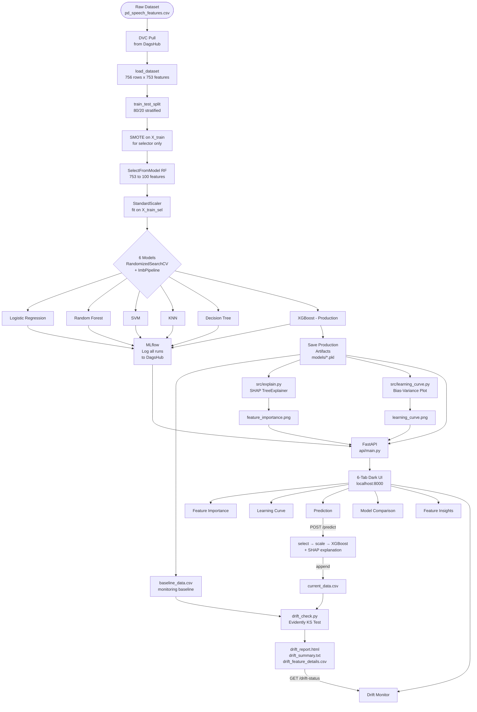
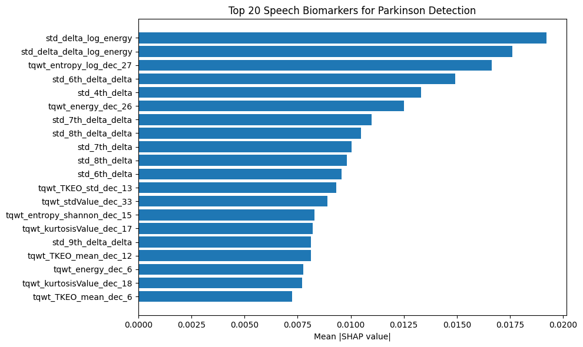
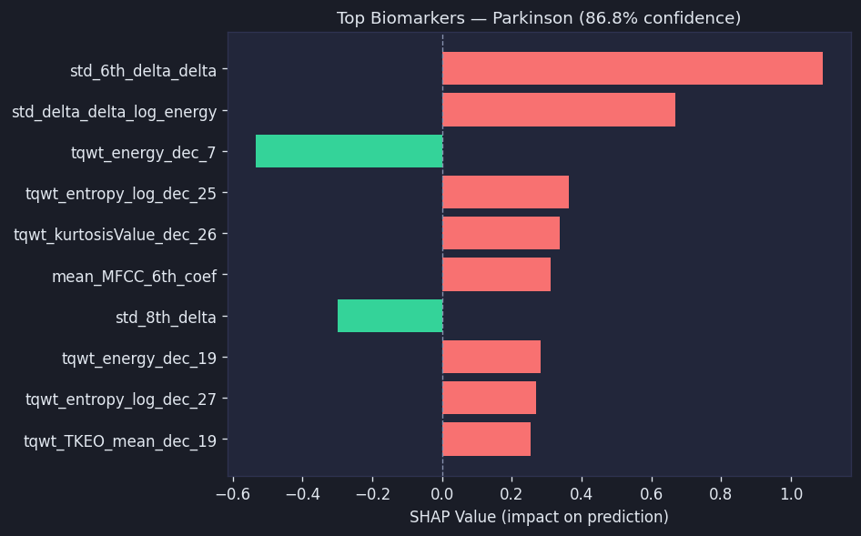
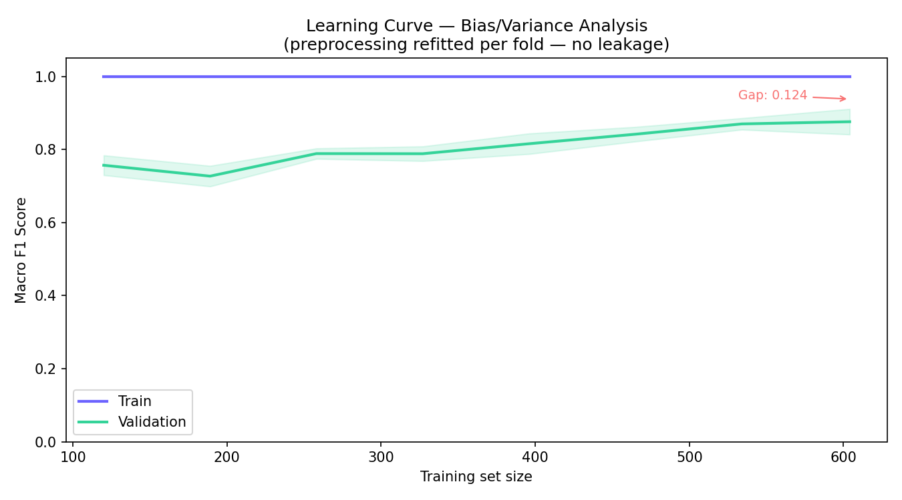

<div align="center">

# Interpretable ML System for Parkinson's Disease Detection

### From Speech Biomarkers to Clinical Insights

[](https://colab.research.google.com/github/nishnarudkar/Interpretable-Machine-Learning-System-for-Parkinson-s-Disease-Detection-from-Speech-Biomarkers/blob/main/notebooks/Parkinsons_Detection_MLOPS_Project_SMOTE.ipynb)
&nbsp;
[](https://www.python.org/)
[](https://fastapi.tiangolo.com/)
[](https://mlflow.org/)
[](https://dvc.org/)
[](https://xgboost.readthedocs.io/)
[](https://shap.readthedocs.io/)
[](https://www.evidentlyai.com/)
[](https://www.docker.com/)
[](https://www.jenkins.io/)

<br/>

> **A production-grade MLOps pipeline that detects Parkinson's disease from voice recordings using interpretable machine learning — with full experiment tracking, data versioning, real-time SHAP explanations, and live data drift monitoring.**

</div>

---

## Authors

<div align="center">

| Name | GitHub |
|---|---|
| Nishant Narudkar | [@nishnarudkar](https://github.com/nishnarudkar) |
| Maitreya Pawar | [@Metzo64](https://github.com/Metzo64) |
| Vatsal Parmar | [@Vatsal211005](https://github.com/Vatsal211005) |
| Aamir Sarang | [@Aamir-Sarang31](https://github.com/Aamir-Sarang31) |

</div>

---

## Table of Contents

- [Overview](#overview)
- [System Architecture](#system-architecture)
- [Full Pipeline Flow](#full-pipeline-flow)
- [Dataset](#dataset)
- [Project Structure](#project-structure)
- [ML Pipeline](#ml-pipeline)
- [Model Results](#model-results)
- [Explainability (SHAP)](#explainability-shap)
- [MLOps Stack](#mlops-stack)
- [Web Application](#web-application)
- [Drift Monitoring](#drift-monitoring)
- [API Reference](#api-reference)
- [Installation & Setup](#installation--setup)
- [Running the Project](#running-the-project)
- [Docker Deployment](#docker-deployment)
- [CI/CD with Jenkins](#cicd-with-jenkins)
- [Technology Stack](#technology-stack)
- [Disclaimer](#disclaimer)

---

## Overview

Parkinson's disease is a progressive neurological disorder whose earliest symptoms often manifest as measurable changes in speech patterns. This project builds a full MLOps system that bridges research and production:

| Capability | Implementation |
|---|---|
| Multi-model comparison | 6 classifiers with RandomizedSearchCV tuning |
| Class imbalance handling | SMOTE inside leakage-free ImbPipeline CV folds |
| Feature selection | SelectFromModel (Random Forest, top 100 features) |
| Experiment tracking | MLflow + DagsHub (remote) |
| Model registry | MLflow Model Registry |
| Explainability | SHAP TreeExplainer (global + per-prediction) |
| Serving | FastAPI + dark-themed 6-tab interactive UI |
| Data versioning | DVC backed by DagsHub |
| Drift monitoring | Evidently AI + native Drift Monitor UI tab |
| Containerisation | Docker multi-stage build |
| CI/CD | Jenkins 7-stage pipeline |

> **Production model:** XGBoost is selected over higher-scoring models (KNN, SVM) because SHAP `TreeExplainer` provides fast, exact feature attribution — critical for a medical application where clinicians need to understand *why* a prediction was made.

---

## System Architecture

```
┌──────────────────────────────────────────────────────────────────┐
│                         DATA LAYER                               │
│   pd_speech_features.csv  ──►  DVC  ──►  DagsHub Remote         │
└─────────────────────────────────┬────────────────────────────────┘
                                  │
┌─────────────────────────────────▼────────────────────────────────┐
│                      TRAINING PIPELINE                           │
│                                                                  │
│   Feature Selection           Scaling            SMOTE           │
│   SelectFromModel(RF) ──►  StandardScaler  ──►  ImbPipeline      │
│   753 → 100 features                                             │
│                                                                  │
│   6 Models × RandomizedSearchCV × StratifiedKFold(5)            │
│   LR  │  RF  │  SVM  │  KNN  │  DT  │  XGBoost                  │
│                                                                  │
│   XGBoost ──► MLflow Registry ──► DagsHub                       │
│   Baseline saved ──► monitoring/baseline_data.csv               │
└─────────────────────────────────┬────────────────────────────────┘
                                  │
┌─────────────────────────────────▼────────────────────────────────┐
│                      EXPLAINABILITY                              │
│   SHAP TreeExplainer ──► feature_importance.png                  │
│   Per-prediction SHAP ──► shap_bar.png + top 10 contributions    │
│   Learning Curve ──► learning_curve.png                          │
└─────────────────────────────────┬────────────────────────────────┘
                                  │
┌─────────────────────────────────▼────────────────────────────────┐
│                       SERVING LAYER                              │
│   FastAPI  ──►  /predict  ──►  select → scale → XGBoost         │
│   6-tab UI: Feature Importance │ Learning Curve │ Prediction     │
│             Model Comparison   │ Feature Insights │ Drift Monitor│
└─────────────────────────────────┬────────────────────────────────┘
                                  │
┌─────────────────────────────────▼────────────────────────────────┐
│                     MONITORING LAYER                             │
│   /predict logs ──► current_data.csv                            │
│   drift_check.py ──► Evidently KS test ──► drift_report.html    │
│   /drift-status ──► Drift Monitor tab (live dashboard)          │
└──────────────────────────────────────────────────────────────────┘
```

---

## Full Pipeline Flow



---

## Dataset

| Property | Value |
|---|---|
| File | `data/pd_speech_features.csv` |
| Size | ~5.3 MB (DVC tracked) |
| Samples | 756 rows |
| Raw columns | 755 (`id` + `class` + 753 features) |
| Selected features | 100 (by Random Forest importance) |
| Target | Binary — `1` = Parkinson's, `0` = Healthy |
| Class distribution | 564 Parkinson's (74.6%) / 192 Healthy (25.4%) |

### Feature Groups

| Group | Description |
|---|---|
| `PPE`, `DFA`, `RPDE` | Nonlinear dynamical complexity measures |
| `numPulses`, `numPeriodsPulses` | Glottal pulse counts |
| `locPctJitter`, `locAbsJitter` | Jitter — frequency variation measures |
| `localShimmer`, `localdbShimmer` | Shimmer — amplitude variation measures |
| `mean_MFCC_*` | Mel-frequency cepstral coefficients (0–12) |
| `tqwt_TKEO_*`, `tqwt_entropy_*` | Tunable Q-factor Wavelet Transform features (36 levels) |
| `f1`–`f4`, `b1`–`b4` | Formant frequencies and bandwidths |

---

## Project Structure

```
.
├── api/
│   └── main.py                      # FastAPI app — all endpoints, SHAP inference, drift API
├── src/
│   ├── config.py                    # Central path + dataset configuration
│   ├── train.py                     # Training pipeline + MLflow logging
│   ├── explain.py                   # SHAP global feature importance
│   ├── learning_curve.py            # Bias-variance analysis
│   ├── model_selection.py           # Interpretability-aware model selection
│   └── mlflow_comparison.py         # MLflow metrics fetcher for UI
├── data/
│   ├── pd_speech_features.csv       # Dataset (DVC tracked)
│   └── pd_speech_features.csv.dvc   # DVC pointer file
├── models/                          # Trained artifacts (gitignored)
│   ├── model.pkl                    # Production XGBoost model
│   ├── scaler.pkl                   # Fitted StandardScaler (100 features)
│   ├── selector.pkl                 # Fitted SelectFromModel (753 → 100)
│   ├── feature_names.pkl            # 100 selected feature names
│   └── column_order.pkl             # Training column order (753 features)
├── artifacts/
│   ├── model_metrics.json           # Per-model comparison metrics
│   └── feature_config.json          # Top features + column means
├── static/                          # Frontend assets + generated charts
│   ├── feature_importance.png       # SHAP global chart
│   ├── learning_curve.png           # Bias-variance plot
│   ├── shap_bar.png                 # Per-prediction SHAP chart
│   ├── feature_medians.json         # Feature defaults for prediction form
│   ├── feature_insights.json        # Biomarker analysis data
│   └── script.js / style.css        # UI assets
├── templates/
│   └── index.html                   # Jinja2 6-tab UI template
├── monitoring/
│   ├── baseline_data.csv            # X_train_sel saved after training
│   ├── current_data.csv             # API inputs logged per prediction
│   ├── drift_check.py               # Evidently drift detection script
│   ├── drift_report.html            # Interactive Evidently report
│   ├── drift_summary.txt            # Plain-text drift summary
│   └── drift_feature_details.csv    # Per-feature KS p-values
├── notebooks/
│   └── Parkinsons_Detection_MLOPS_Project_SMOTE.ipynb
├── docs/
│   └── TECHNICAL_DOCUMENTATION.md  # Full technical reference
├── dvc.yaml                         # DVC pipeline definition
├── Dockerfile                       # Multi-stage container build
├── Jenkinsfile                      # 7-stage CI/CD pipeline
├── requirements.txt                 # Full pinned dependencies
├── requirements-api.txt             # API-only dependencies (Docker)
└── .env.example                     # Credentials template
```

---

## ML Pipeline

### Step 1 — Feature Selection

```python
# SMOTE applied first so RF selector learns minority class features
smote_fs = SMOTE(random_state=42)
X_train_fs, y_train_fs = smote_fs.fit_resample(X_train, y_train)

selector = SelectFromModel(RandomForestClassifier(n_estimators=100), max_features=100)
selector.fit(X_train_fs, y_train_fs)   # 753 → 100 features
```

### Step 2 — Scaling

`StandardScaler` applied **after** selection (`select → scale`). Fitted only on training data to prevent leakage.

### Step 3 — SMOTE inside ImbPipeline

```python
pipeline = ImbPipeline([
    ("smote", SMOTE(random_state=42)),
    ("model", SomeClassifier()),
])
RandomizedSearchCV(pipeline, param_dist, cv=StratifiedKFold(5), scoring="f1_macro")
```

SMOTE is applied **inside each CV fold** — validation folds always contain real, unaugmented data.

### Step 4 — Model Training

| Model | Input | Iterations | Key Params Tuned |
|---|---|---|---|
| Logistic Regression | Scaled | 20 | C, solver |
| Random Forest | Unscaled | 20 | n_estimators, max_depth, max_features |
| SVM | Scaled | 15 | C, gamma, kernel |
| KNN | Scaled | 15 | n_neighbors, weights, metric |
| Decision Tree | Unscaled | 20 | max_depth, criterion, min_samples |
| XGBoost | Unscaled | 30 | max_depth, gamma, subsample, colsample_bytree |

---

## Model Results

| Model | Accuracy | Macro F1 | ROC AUC | Selected |
|---|---|---|---|---|
| SVM | 0.895 | 0.854 | 0.964 | |
| KNN | 0.882 | 0.858 | 0.950 | |
| **XGBoost** | **0.882** | **0.836** | **0.943** | Production |
| Random Forest | 0.862 | 0.817 | 0.919 | |
| Decision Tree | 0.849 | 0.809 | 0.818 | |
| Logistic Regression | 0.829 | 0.783 | 0.830 | |

All metrics are macro-averaged on the held-out test set (152 samples). XGBoost is selected for interpretability — SHAP `TreeExplainer` provides fast, exact feature attribution essential for clinical transparency.

### Best XGBoost Configuration

```
max_depth        : 5       colsample_bytree : 0.8
min_child_weight : 1       n_estimators     : 300
gamma            : 0       learning_rate    : 0.05
subsample        : 0.8
```

---

## Explainability (SHAP)

### Global Feature Importance

- `TreeExplainer` computes mean absolute SHAP values across 50 sampled rows
- Top 20 most influential speech biomarkers plotted to `static/feature_importance.png`
- Displayed in the Feature Importance tab



### Per-Prediction Explanation

Every `/predict` call returns:
- Top 10 SHAP feature contributions with actual feature names
- A server-generated `shap_bar.png` (dark-themed horizontal bar chart)
- Positive values push toward Parkinson's, negative values push toward Healthy



```json
{
  "feature_name": "tqwt_kurtosisValue_dec_5",
  "impact": 0.2341
}
```

### Learning Curve

Full `ImbPipeline` (SMOTE → SelectFromModel → StandardScaler → model) refitted per CV fold — no leakage. Plots train vs. validation macro F1 with ±1 std confidence bands.



---

## MLOps Stack

### MLflow + DagsHub

```python
dagshub.init(repo_owner="nishnarudkar", repo_name="...", mlflow=True)
mlflow.set_experiment("parkinson_detection")
```

Each run logs: `accuracy`, `macro_f1`, `roc_auc`, `precision`, `recall`, hyperparameters, and the serialised model. XGBoost is registered atomically in the MLflow Model Registry.

### DVC Pipeline

```yaml
stages:
  train:          python src/train.py          → models/*.pkl, artifacts/model_metrics.json
  explain:        python src/explain.py         → static/feature_importance.png
  learning_curve: python src/learning_curve.py  → static/learning_curve.png
```

Run with: `dvc repro`

---

## Web Application

Six-tab dark-themed UI served by FastAPI + Jinja2:

| Tab | Content |
|---|---|
| Feature Importance | Global SHAP chart + top 5 biomarkers ranked list |
| Learning Curve | Bias-variance plot with confidence bands + legend |
| Prediction | 5-input form (top SHAP features) + result card + SHAP explanation |
| Model Comparison | Live leaderboard from MLflow metrics |
| Feature Insights | Biomarker analysis — Parkinson's vs. Healthy mean comparisons |
| Drift Monitor | Live drift dashboard — status banner, drifted features chart, full feature table |

---

## Drift Monitoring

### How It Works

```
Training run
    └── saves monitoring/baseline_data.csv  (X_train_sel, unscaled)

Every /predict call
    └── appends to monitoring/current_data.csv  (same feature space)

python monitoring/drift_check.py
    └── Evidently KS test: baseline vs. current
    └── saves drift_report.html, drift_summary.txt, drift_feature_details.csv

GET /drift-status
    └── reads those files → Drift Monitor tab renders live dashboard
```

### Drift Monitor Tab

- Status banner (green = no drift / red = drift detected) with percentage and count gauge
- Bar chart of the top 15 most drifted features by KS p-value
- Full feature table with All / Drifted only / Stable only filter
- Info note when simulated data is used (fewer than 50 real predictions logged)

A feature is considered drifted when its KS p-value < 0.05. If more than 50% of features drift, retraining is recommended.

### Jenkins Integration

The Drift Detection stage runs after every build and archives `drift_report.html` as a Jenkins build artifact.

---

## API Reference

### `GET /health`
```json
{ "status": "ok", "model": "XGBClassifier", "explainer": "TreeExplainer", "model_loaded": true }
```

### `POST /predict`

**Request:** `{ "features": [753 floats in training column order] }`

**Response:**
```json
{
  "prediction": 1,
  "label": "Parkinson's Detected",
  "probability": 0.923,
  "top_contributions": [
    { "feature_index": 42, "feature_name": "tqwt_kurtosisValue_dec_5", "impact": 0.2341 }
  ],
  "shap_bar_url": "/static/shap_bar.png"
}
```

### `GET /feature-defaults`
Returns top 5 SHAP-ranked features with `median`, `min`, `max` and all 753 column medians.

### `GET /model-comparison`
Returns model leaderboard from `artifacts/model_metrics.json`, sorted by ROC AUC.

### `GET /top-features`
Returns top 5 globally important features by mean absolute SHAP value.

### `GET /drift-status`
Returns latest drift check results.

**Response:**
```json
{
  "summary": {
    "total_features": 100,
    "drifted_count": 42,
    "drift_pct": 42.0,
    "generated_at": "2026-04-05 02:28:52",
    "status": "No significant dataset drift"
  },
  "features": [
    { "feature": "std_10th_delta_delta", "p_value": 0.0,    "drifted": true  },
    { "feature": "std_Log_energy",       "p_value": 0.9929, "drifted": false }
  ]
}
```

Returns `404` if drift files don't exist — run `python monitoring/drift_check.py` first.

---

## Installation & Setup

```bash
# 1. Clone the repository
git clone https://github.com/nishnarudkar/Interpretable-Machine-Learning-System-for-Parkinson-s-Disease-Detection-from-Speech-Biomarkers.git
cd Interpretable-Machine-Learning-System-for-Parkinson-s-Disease-Detection-from-Speech-Biomarkers

# 2. Create and activate virtual environment
python -m venv venv
venv\Scripts\activate          # Windows
# source venv/bin/activate     # Linux / macOS

# 3. Install dependencies
pip install -r requirements.txt

# 4. Configure credentials
copy .env.example .env
# Edit .env — fill in DAGSHUB_USERNAME and DAGSHUB_TOKEN

# 5. Pull dataset via DVC
dvc pull
```

---

## Running the Project

### Option A — DVC pipeline (recommended)

```bash
dvc repro
uvicorn api.main:app --host 0.0.0.0 --port 8000
```

### Option B — Step by step

```bash
python src/train.py
python src/explain.py
python src/learning_curve.py
uvicorn api.main:app --host 0.0.0.0 --port 8000
```

Open **http://localhost:8000**

### Drift Monitoring

```bash
# After running predictions through the UI:
python monitoring/drift_check.py
# Then open the Drift Monitor tab
```

### What each step produces

| Script | Outputs |
|---|---|
| `train.py` | `models/*.pkl`, `artifacts/model_metrics.json`, `static/feature_medians.json`, `monitoring/baseline_data.csv` |
| `explain.py` | `static/feature_importance.png` |
| `learning_curve.py` | `static/learning_curve.png` |
| `drift_check.py` | `monitoring/drift_report.html`, `drift_summary.txt`, `drift_feature_details.csv` |
| `uvicorn` | Live web app at port 8000 |

---

## Docker Deployment

Multi-stage build — only API dependencies in the runtime image.

```bash
docker build -t parkinson-api .
docker run -p 8000:8000 parkinson-api
```

Open **http://localhost:8000**

---

## CI/CD with Jenkins

7-stage automated pipeline (Windows agent, `bat` commands):

| Stage | Command |
|---|---|
| Install Dependencies | `pip install -r requirements.txt` |
| Pull Data (DVC) | `dvc pull data/pd_speech_features.csv.dvc --force` |
| Train Model | `python src/train.py` |
| Generate Explanations | `python src/explain.py` + `python src/learning_curve.py` |
| Smoke Test | `curl -f http://localhost:8000/health` |
| Build Docker Image | `docker build -t parkinson-api .` |
| Drift Detection | `python monitoring/drift_check.py` — archives `drift_report.html` |

Credentials injected via Jenkins credentials store — never hardcoded.

---

## Technology Stack

| Category | Tools |
|---|---|
| ML / Data | scikit-learn 1.8, XGBoost 3.2, pandas 2.3, numpy 2.4, imbalanced-learn 0.14, scipy 1.17 |
| Explainability | SHAP 0.51 (TreeExplainer + KernelExplainer) |
| Experiment Tracking | MLflow 3.10, DagsHub 0.6.9 |
| Data Versioning | DVC 3.67 |
| Drift Monitoring | Evidently 0.7 |
| Web Framework | FastAPI 0.135, Uvicorn 0.42, Jinja2 3.1 |
| Frontend | HTML5, CSS3, JavaScript, Chart.js |
| Containerisation | Docker (multi-stage) |
| CI/CD | Jenkins (7-stage, Windows) |
| Visualisation | matplotlib 3.10, seaborn 0.13 |

---

## Disclaimer

This project is intended for **research and educational purposes only**. It is not a validated medical diagnostic tool. Do not use predictions from this system for clinical decision-making. Always consult a qualified healthcare professional for medical advice.
